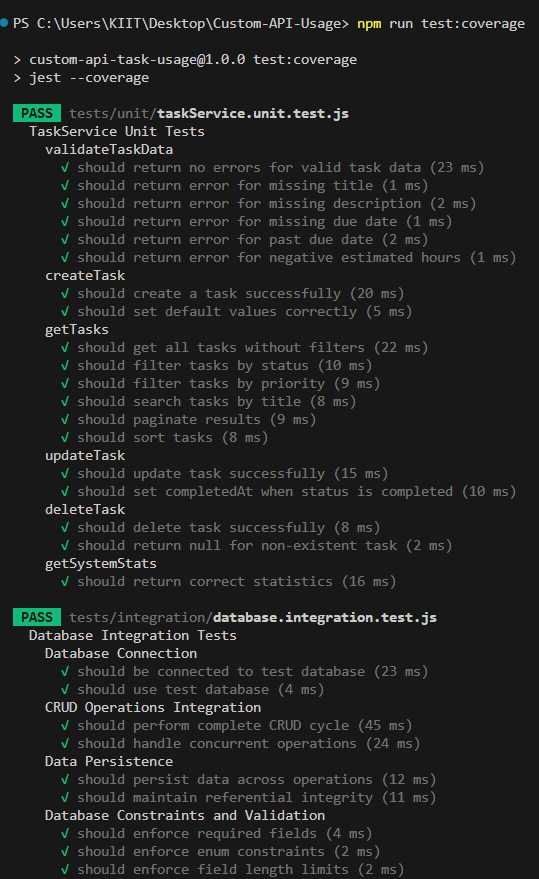
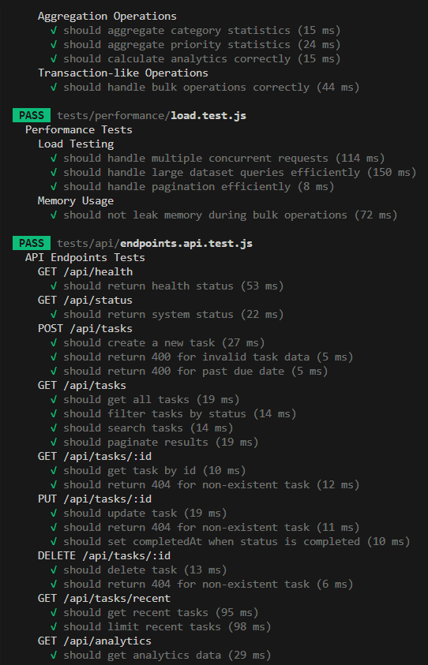
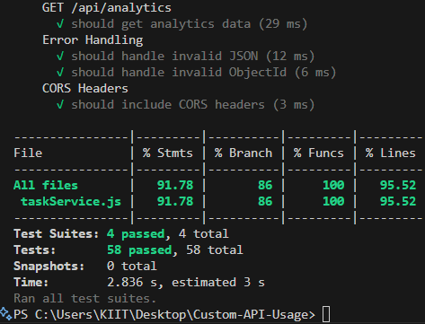
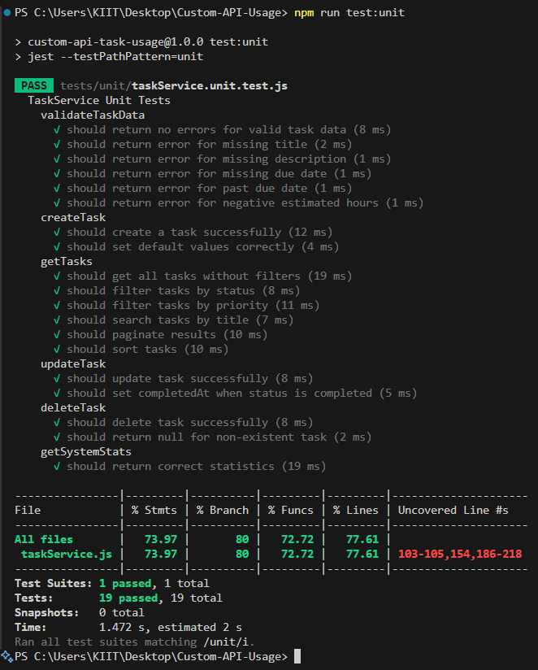

# Custom API Task Management System

A task management application built with custom API endpoints, MongoDB database integration, and a React frontend. This project demonstrates complete CRUD operations, database integration, and custom API development skills. A custom server that exposes self-designed API endpoints to serve and manage data from a connected database, integrated with a frontend for user interaction.

## Project Overview

This **Custom API Task Usage System** showcases:

- **Custom API Development** - RESTful endpoints built with Express.js
- **Database Integration** - MongoDB Atlas with Mongoose ODM
- **Frontend Interface** - React dashboard for API interaction
- **Full CRUD Operations** - Complete Create, Read, Update, Delete functionality
- **Real-time Features** - Live dashboard updates and system monitoring

> Note: The API status will show as "Connected" when the backend server is running on ur device or hosted environment.

## APIs Created

### 1. Health Check

- **GET** `/api/health` - Server status and available endpoints

### 2. System Status  

- **GET** `/api/status` - Database stats and task counts

### 3. Tasks CRUD

- **GET** `/api/tasks` - Get all tasks (with filtering, search, pagination)
- **POST** `/api/tasks` - Create new task
- **GET** `/api/tasks/:id` - Get single task
- **PUT** `/api/tasks/:id` - Update task
- **DELETE** `/api/tasks/:id` - Delete task

### 4. Recent Tasks

- **GET** `/api/tasks/recent` - Get recently created tasks

### 5. Analytics

- **GET** `/api/analytics` - Task analytics and insights

## Database Integration

**MongoDB Atlas** with Mongoose ODM

### Task Schema

```
{
  title: String (required),
  description: String (required), 
  status: String (pending/in-progress/completed/cancelled),
  priority: String (low/medium/high/urgent),
  category: String,
  assignedTo: String,
  dueDate: Date (required),
  estimatedHours: Number,
  tags: [String],
  createdAt: Date,
  updatedAt: Date,
  completedAt: Date
}
```

### Connection Setup

```
mongoose.connect(process.env.MONGODB_URI)
```

## Running the Server

### Prerequisites

- Node.js 18+
- MongoDB Atlas account

### Setup

```
npm install
```

Create `.env` file:

```
MONGODB_URI=your_mongodb_connection_string
PORT=5000
NODE_ENV=development
```

### Start Server

```
# API server only
npm run server

# Both API and frontend
npm run dev:all
```

Server runs on `http://localhost:5000`

## Running Frontend

```
npm run dev
```

Frontend runs on `http://localhost:3000`

## Testing

### Testing Framework

- **Jest**: Primary testing framework  
- **Supertest**: HTTP assertion library for API testing  
- **MongoDB Memory Server**: In-memory MongoDB for testing

### Test Types

#### Unit Tests
```
npm run test:unit
```

- Tests business logic and validation
- Mocks database operations
- Covers TaskService methods

#### Integration Tests
```
npm run test:integration
```

- Tests database interactions
- Real MongoDB operations
- CRUD operation verification

#### API Tests
```
npm run test:api
```

- Tests HTTP endpoints
- Request/response validation
- Error handling verification

### Running All Tests

Run all tests
```
npm test
```

Run with coverage
```
npm run test:coverage
```

Watch mode
```
npm run test:watch
```


### Test Coverage

- **Target**: 70%+ code coverage
- **Metrics**: Lines, Functions, Branches, Statements
- **Report**: Generated in coverage





### Test Results Example ( for unit test)
> Above 70%



## API Usage Examples

### Health Check

```
curl http://localhost:5000/api/health
```

### Get All Tasks

```
curl http://localhost:5000/api/tasks
```

### Create Task

```
curl -X POST http://localhost:5000/api/tasks \
  -H "Content-Type: application/json" \
  -d '{
    "title": "Fix login bug",
    "description": "User login not working properly",
    "dueDate": "2024-12-31",
    "priority": "high",
    "category": "bug-fix"
  }'
```

### Update Task

```
curl -X PUT http://localhost:5000/api/tasks/TASK_ID \
  -H "Content-Type: application/json" \
  -d '{"status": "completed"}'
```

### Delete Task

```
curl -X DELETE http://localhost:5000/api/tasks/TASK_ID
```

### Search and Filter

```
# Search tasks
curl "http://localhost:5000/api/tasks?search=login"

# Filter by status
curl "http://localhost:5000/api/tasks?status=pending"

# Multiple filters
curl "http://localhost:5000/api/tasks?status=in-progress&priority=high&limit=10"
```

### Get Analytics

```
curl http://localhost:5000/api/analytics
```

## Response Format

### Success Response

```
{
  "success": true,
  "message": "Operation completed",
  "data": {...},
  "count": 10
}
```

### Error Response

```
{
  "success": false,
  "message": "Error description",
  "error": "Detailed error"
}
```

## Testing

```
# Run API tests
npm test

# Test all endpoints
npm run test:all
```

## Tech Stack

- **Backend**: Express.js, MongoDB, Mongoose
- **Frontend**: React, Next.js, Tailwind CSS
- **Tools**: CORS, dotenv, Axios

## Project Structure

```
├── server.js              # Main API server
├── app/
│   ├── page.js            # Dashboard
│   └── globals.css        # Styles
├── components/            # React components
├── test-api.js           # API tests
├── package.json          # Dependencies
└── .env                  # Environment variables
```

## Features

- Full CRUD operations
- Advanced filtering and search
- Real-time dashboard
- MongoDB aggregation queries
- Error handling and validation
- Request logging
- Automatic timestamps
